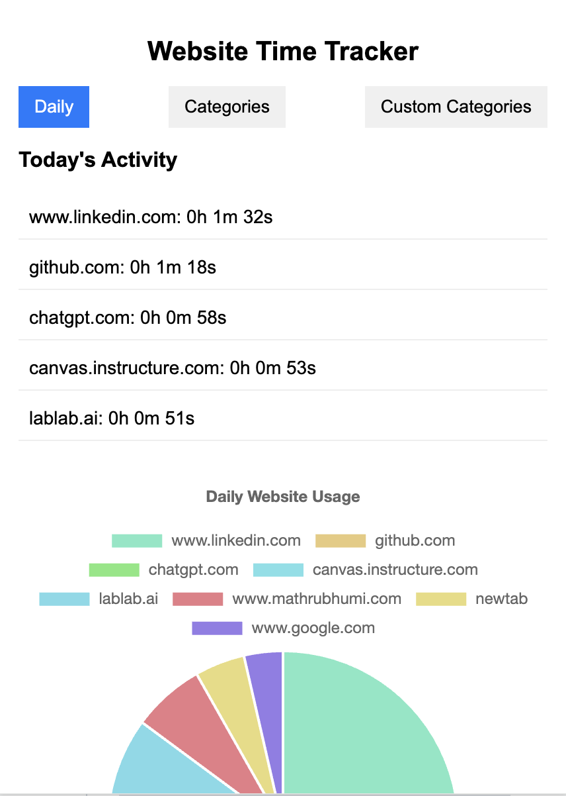
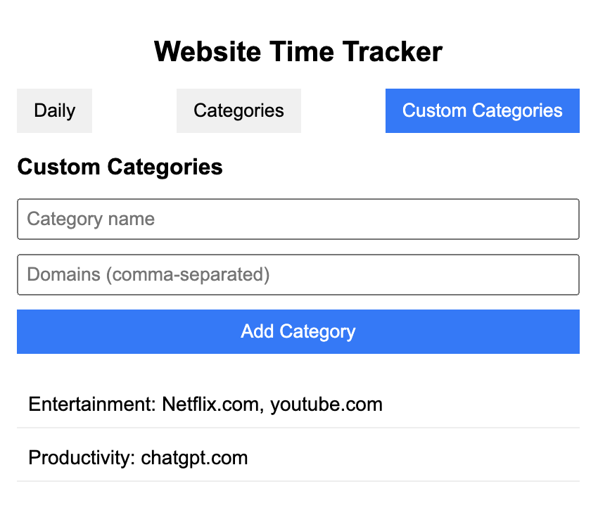

# Website Time Tracker Chrome Extension

## Description

Website Time Tracker is a Chrome extension that helps users monitor and analyze their web browsing habits. It tracks the time spent on different websites, categorizes them, and provides visual representations of the data.

This project was created as part of an exploration into Cursor.com, an innovative AI-powered code editor that's reshaping the landscape of programming.

## Screenshots

### Extension Popup

*The interface of the Website Time Tracker extension*

## About Cursor and This Project

This extension was developed using Cursor (cursor.com), an AI-augmented code editor that's pushing the boundaries of how we write and understand code. Cursor integrates powerful language models to assist in coding, making the development process more intuitive and efficient.

Working on this project with Cursor has been an eye-opening experience. The AI-assisted coding environment provided by Cursor feels like a glimpse into the future of programming. It's not just about auto-completion; it's about having an intelligent assistant that understands context, can explain complex code, and even help in debugging.

Some cool aspects of using Cursor for this project:

1. Rapid prototyping: The AI suggestions helped in quickly implementing features and exploring different approaches.
2. Code explanations: When dealing with complex parts of the Chrome extension API, Cursor's explanations were invaluable.
3. Bug detection: The AI often caught potential issues before they became problems, saving debugging time.
4. Learning tool: For developers new to Chrome extension development, Cursor acted as a knowledgeable guide.

While this project is relatively small, it demonstrates the potential of AI-assisted coding. Tools like Cursor are paving the way for a future where developers can focus more on problem-solving and creativity, while AI handles more of the routine aspects of coding.

## Features

- Real-time tracking of time spent on websites
- Daily breakdown of website usage
- Categorization of websites (predefined and custom categories)
- Visual representation of data using charts
- Custom category management

## Installation

1. Clone this repository or download the ZIP file and extract it.
2. Open Google Chrome and navigate to `chrome://extensions/`.
3. Enable "Developer mode" in the top right corner.
4. Click "Load unpacked" and select the directory containing the extension files.

## Usage

1. Click on the extension icon in the Chrome toolbar to open the popup.
2. View your daily website usage in the "Daily" tab.
3. Check category-wise time spent in the "Categories" tab.
4. Add custom categories in the "Custom Categories" tab.

## File Structure

- `manifest.json`: Extension configuration file
- `background.js`: Background script for time tracking
- `popup.html`: HTML structure for the extension popup
- `popup.js`: JavaScript for popup functionality and data visualization
- `styles.css`: CSS styles for the popup
- `chart.js`: Chart.js library for data visualization
- `icon.png`: Extension icon

## Development

To modify or extend the extension:

1. Edit the relevant files (`background.js`, `popup.js`, `popup.html`, `styles.css`).
2. Make sure to reload the extension in `chrome://extensions/` after making changes.
3. For major changes, increment the version number in `manifest.json`.

## Dependencies

- [Chart.js](https://www.chartjs.org/) - Used for creating charts and graphs

### Acknowledgements

A big thank you to the teams behind Cursor and TSAI mentor Rohan for getting me introduced to this toolkit :-)

