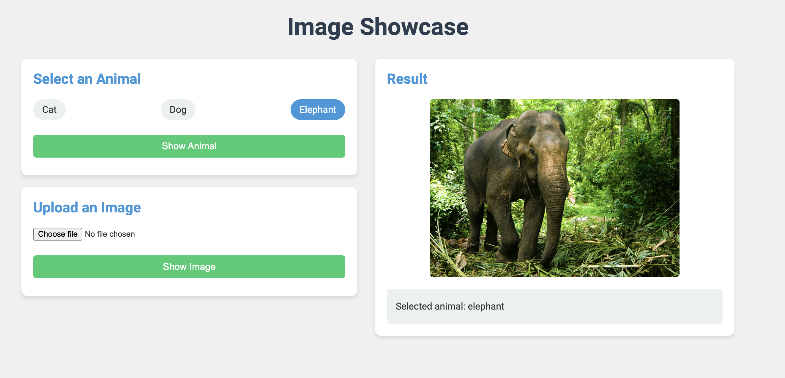

# Image Showcase

Image Showcase is a web application that allows users to view predefined animal images or upload their own images. It provides a simple and intuitive interface for image display and basic file information retrieval.



## Features

- Display predefined images of animals (cat, dog, elephant)
- Upload and display user images
- Show file information (name, size, type) for uploaded images
- Responsive and user-friendly interface

## Technologies Used

- Backend: FastAPI (Python)
- Frontend: HTML, CSS, JavaScript
- Additional: 
  - uvicorn (ASGI server)
  - Jinja2 (templating engine)


1. Install the required packages:
   ```
   pip install fastapi uvicorn jinja2 python-multipart
   ```

2. Run the application:
   ```
   python app.py
   ```

3. Open a web browser and navigate to `http://localhost:8000`

## Usage

1. Select an Animal:
   - Choose one of the radio buttons (Cat, Dog, or Elephant)
   - Click the "Show Animal" button to display the selected animal image

2. Upload an Image:
   - Click the "Choose File" button to select an image from your device
   - Click the "Show Image" button to upload and display the selected image

The result will be shown in the display area on the right, including the image and relevant information.

